# HISTORIA DE ESPAÑA DE LA EDAD MEDIA - LA PENÍNSULA IBÉRICA DE LOS SIGLOS XI A XV

# 1. LA DECADENCIA POLÍTICA Y TERRITORIAL DE AL-ÁNDALUS (1031-1492)

## 1.1. Los reinos de taifas, los almorávides, los almohades.

A partir del año 1031, tras la desaparición del califato de Córdoba, al-Andalus inició una progresiva decadencia política y territorial. Esta fue aprovechada por los estados cristianos del norte peninsular para expandirse hacia el sur y extender su territorio.

Durante esta época, la evolución de al-Ándalus pasó por tres periodos: los reinos de taifas, la dominación almorávide y la almohade.

---

### Los reinos de taifas (1031-1085)

Cada reino taifa comprendía una ciudad principal y el territorio de alrededor, y estuvo dominado por un determinado grupo étnico:

- Los **árabes**, en Córdoba, Sevilla, Badajoz, Toledo, Zaragoza y Murcia.
- Los **musulmanes** de origen eslavo, en el este peninsular.
- Los **bereberes**, en Málaga y Sevilla.

Los estados cristianos del norte aprovecharon su debilidad, primero, para cobrarles tributos o parias a cambio de la paz; y, luego, para atacarlos. Así, Alfonso VI de León conquistó Toledo (1085).

---

### Los almorávides (1086-1144)

Tras la conquista de Toledo, temiendo desaparecer, los reyes de las taifas pidieron ayuda a los almorávides, bereberes nómadas que a principios del siglo XI habían formado un gran imperio en el norte de África, con capital en Marrakech.

Los almorávides entraron en la Península en 1086 y, ese mismo año, derrotaron al ejército de Alfonso VI de León en la batalla de Sagrajas.

Después, impusieron su dominio en al-Ándalus, que incorporaron a su imperio africano, e implantaron un fuerte radicalismo religioso, persiguiendo a los mozárabes y a los judíos.

En 1145, se desintegraron en los llamados **segundos reinos de taifas**.

---

### Los almohades (1147-1224)

Los almohades, tras conquistar Marrakech en 1147, sustituyeron a los almorávides en el norte de África. Penetraron en la Península ese mismo año, aunque no consiguieron dominar todo el territorio andalusí hasta 1172, en el que implantaron un mayor radicalismo religioso.

En un principio, los almohades paralizaron las conquistas cristianas al derrotar a Alfonso VIII de Castilla en **Alarcos** (1195). Pero después, fueron derrotados en la batalla de las **Navas de Tolosa** (1212), que permitió el avance cristiano por el valle del Guadalquivir.

Desde ese momento, el poderío almohade decayó. Finalmente, los almohades fueron expulsados al norte de África, y al-Ándalus se desintegró en 1224 en los **terceros reinos de taifas**, que fueron conquistados progresivamente por los cristianos.

Desde 1238, y hasta su desaparición en 1492, el territorio andalusí quedó reducido al **reino nazarí de Granada**.

---

### La evolución artística

- El **arte de los primeros reinos de taifas** se caracterizó por el empleo de materiales pobres, como el ladrillo; el uso del yeso en revestimientos decorativos; y la utilización de arcos muy variados, como mixtilíneos y de herradura apuntada. Las realizaciones artísticas principales de este periodo fueron el **palacio de la Aljafería de Zaragoza**, con una rica decoración; y la **alcazaba de Málaga**, una fortificación palaciega donde residían los reyes y los gobernadores.

- Los **almorávides** apenas dejaron manifestaciones artísticas en la Península. La más destacada es el castillo de Monteagudo, en Murcia.

- Los **almohades** impulsaron una arquitectura sencilla y austera. Sus realizaciones artísticas principales fueron la **Giralda de Sevilla**, alminar de la mezquita mayor de la ciudad decorada con la típica sebka o red de rombos almohade, y la **Torre del Oro**, edificio defensivo poligonal, rematado en almenas, situado a orillas del Guadalquivir.

---

## 1.2. El Reino nazarí de Granada.

El reino nazarí de Granada, formado en 1238, fue el único reino musulmán que pervivió en la Península en la Baja Edad Media.

Su supervivencia hasta 1492 se debió a distintas **circunstancias favorables**. Así, su situación geográfica facilitó que las montañas de Sierra Nevada actuaran como una muralla natural de protección; su apertura al Mediterráneo favoreció el apoyo de los musulmanes del norte de África y un floreciente comercio; y la diplomacia se utilizó para comprar la paz a Castilla, a cambio del pago de tributos o parias.

Los **conflictos políticos** fueron constantes en el reino nazarí durante toda su historia. Estos fueron aprovechados por los cristianos para ir conquistando pequeños territorios.

La **economía** nazarí, en cambio, alcanzó una gran prosperidad. Se basó en la extensión del regadío; la explotación minera; la artesanía textil, en la que la seda jugó un papel destacado, y el comercio con el África musulmana y los reinos cristianos peninsulares y europeos.

---

### El arte nazarí

En este periodo, la principal obra arquitectónica fue la **Alhambra** de Granada, una fortaleza palacio que recibe su nombre del color rojizo de sus muros. Consta de varias partes.

- La **alcazaba**, realizada en el siglo XIII por Alhamar, el fundador de la dinastía nazarí, es un recinto fortificado donde se localizaba la guarnición militar. Consta de murallas y torres defensivas, como la torre del Homenaje y la torre de la Vela. La alcazaba conectaba con el **Generalife**, finca de recreo con jardines edificada por Muhammad II.

- La **Casa Real**, realizada en el siglo XIV, incluye dos palacios reales encargados por Yusuf I y Mohamed V. Construidos con materiales pobres, tienen paredes decoradas con cerámica y paneles de yeso, y techumbres de madera o de mocárabes. Los palacios constaban de dos cuartos o conjunto de habitaciones en torno a patios, con fuentes y jardines.

• El **Cuarto de Comares** era la parte pública. Sus dependencias se organizaban en torno al patio de los Arrayanes, destacando la sala para administrar justicia, o Mexuar, y el salón de Embajadores.

• El **Cuarto de los Leones** era la parte privada. Se disponía en torno al patio de los Leones, y encerraba el harén y los aposentos privados del califa.

- El conjunto se completaba con una **ciudad palatina**, o barrio administrativo con casas, mezquitas, baños públicos y cementerio; y se rodeaba por un **recinto amurallado**, comunicado con el exterior a través de grandes puertas como la puerta de la Justicia.

---

# 2. RECONQUISTA Y REPOBLACIÓN. LOS REINOS CRISTIANOS EN LA PLENA Y BAJA EDAD MEDIA

## 2.1. La Reconquista bajo el liderazgo de Castilla y de Aragón.

Ya en el **siglo XII** hay que ver todo lo que sucede en la península Ibérica a partir de la **Corona de Castilla y la Corona de Aragón, que comandarán la conquista final de la Península** aprovechando los problemas internos de los musulmanes. Por su parte Navarra no tendrá cambios en sus fronteras. Así debemos destacar las siguientes conquistas: en primer lugar, Castilla, con Alfonso VI y la conquista de **Toledo** en 1085, y, posteriormente, **Cuenca** en 1177; por parte de Aragón, la conquista de **Zaragoza** en 1118.

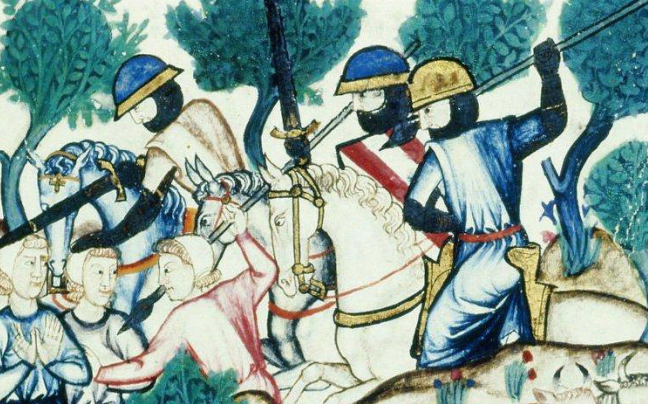

Tras su victoria en Alarcos en 1195, en 1211 los musulmanes amenazaban Toledo. Ante esta delicada situación, **Alfonso VIII**, rey de Castilla, no duda en otorgar el carácter de **cruzada** a la ofensiva a acometer ante los musulmanes, y así proteger Toledo y las fronteras del Tajo. Alfonso VIII solicita ayuda al resto de los reinos cristianos de la Península y al **papa Inocencio III**; de esta manera llegarán **cruzados** de toda Europa. El 19 de julio de **1212** salen de Toledo las huestes cristianas tomando distintos territorios hasta llegar al lugar en el que tendrá lugar la batalla que marcará un antes y un después en la Reconquista: **Las Navas de Tolosa**. Los cristianos vencerán, marcando el inicio de una expansión ya definitiva e inevitable de los reinos cristianos por toda la Península.

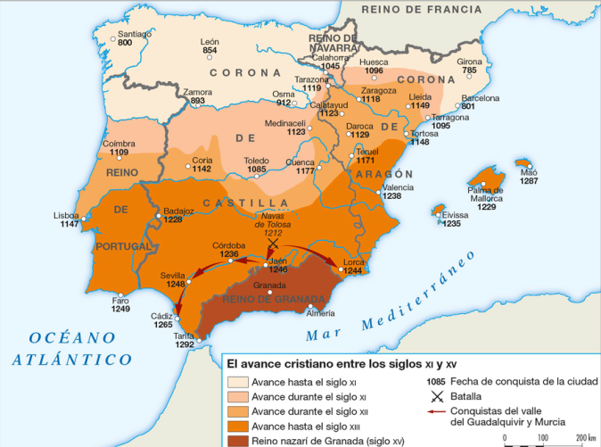

Tras las Navas de Tolosa, Castilla y Aragón siguen avanzando y conquistando la Península:

Es con **Fernando III** el Santo cuando **Castilla** lidere el avance por **Andalucía**: se van a conquistar Córdoba (1236), Murcia (1243), Jaén (1246) o Sevilla (1248). El sucesor de Fernando III será **Alfonso X el Sabio**, uno de los reyes más importantes del periodo medieval; con él se conquista Cádiz. Por tanto, en torno al 1270, sólo quedaba en poder de los musulmanes el reino de Granada (a mediados del siguiente siglo se toma Algeciras).

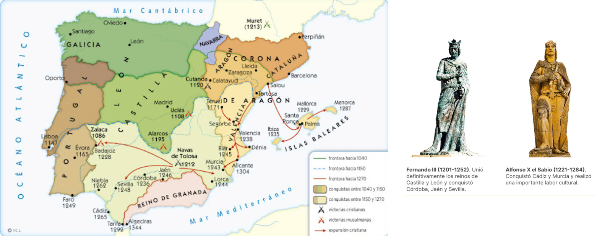

Respecto a **Aragón**, es con el reinado de **Jaime I** cuando se van a dar una serie de victorias importantes en la década de 1230, que supondrán la conquista de **Baleares y Valencia**. Respecto a Murcia, fueron los castellanos quienes lograron su reconquista; pero Aragón alegó sus derechos sobre este territorio. La solución llegó por vía diplomática: Castilla ocupó la mayor parte del reino, pero la zona alicantina se incorporó a la Corona de Aragón.

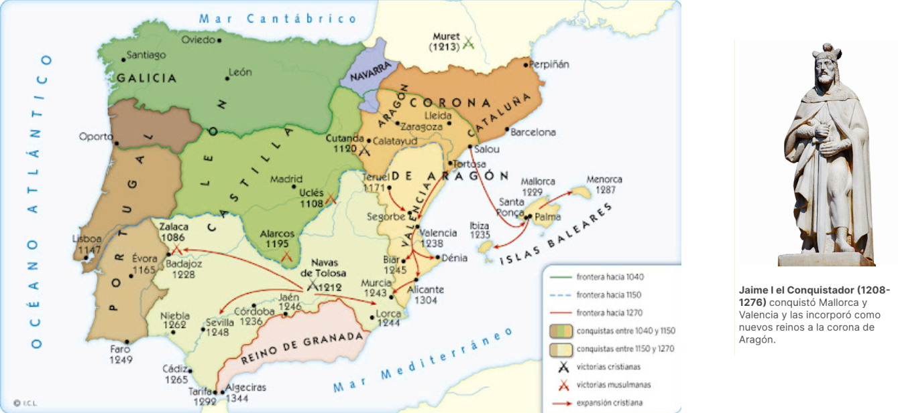

---

## 2.2. La Baja Edad Media: Los cinco reinos peninsulares y su expansión.

A finales de la Edad Media, el mapa de la península Ibérica estaba formado por **cinco reinos independientes**: Castilla, Aragón, Navarra, Portugal y el nazarí de Granada. Los cuatro primeros eran cristianos, mientras que Granada era el último reino musulmán.

- **Fernando III**, para la **Corona de Castilla, unió en un solo reino Castilla y León en 1230**. Castilla **comprendería también Extremadura, toda Andalucía (a partir de 1492)** y Murcia. Además, a lo largo de la Baja Edad Media Castilla comenzaría la **conquista de las Canarias** (Lanzarote, Fuerteventura, la Gomera y el Hierro); más tarde se haría con **Gibraltar (1462)**.

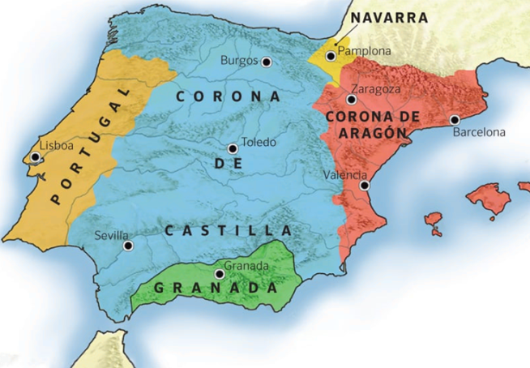

- La **Corona de Aragón** estaría compuesta por **Aragón, Cataluña, Valencia y Baleares**. Además, comenzará a tener una importante **expansión por el Mediterráneo, haciéndose con Cerdeña, Sicilia** y, en el siglo XV, **Nápoles**.

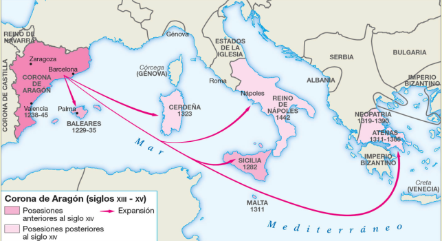

- **Navarra** no pudo proseguir su expansión territorial, al quedar bloqueada entre Aragón y Castilla y quedarse sin frontera con los musulmanes. A finales de la Edad Media y comienzos de la Edad Moderna habrá disputas por este reino entre **Castilla y Francia**.

- **Portugal** se independizó de León en 1143. A partir de ese momento inició su propia expansión territorial hacia el sur, terminando su expansión en el siglo XIII.

---

## 2.3. La repoblación del territorio conquistado.

A medida que los reinos cristianos se expandían hacia el sur y conquistaban tierras que antes habían pertenecido a los musulmanes, se planteaba la cuestión de cómo **repoblarlas**.

El primer sistema, utilizado hasta la línea del Duero, fue el de la **presura**, la ocupación libre y espontánea de la tierra por los cristianos (campesinos, monasterios y nobles), que se convertían así en propietarios. La administración del territorio se organizó en distritos en torno a castillos, gobernados por delegados del rey o del conde. Estos, junto con los habitantes del distrito, tenían la obligación de defenderlo.

Posteriormente, para los valles del Duero, del Tajo y del Ebro se acudió a la **repoblación concejil**. En este sistema, el territorio conquistado se dividía en **concejos o municipios**, formados por una **villa o ciudad amurallada y un término municipal o alfoz. Cada concejo recibía del rey un fuero o ley**, que recogía los deberes, derechos y privilegios de sus habitantes (la ayuda militar que debían prestar al rey, los impuestos a pagar, el permiso para celebrar ferias o mercados, etc). Los repobladores recibían una casa, o solar, y tierras cuyo tamaño dependía de la capacidad para hacer la guerra.

  

En la zona centro-este de España, principalmente en Castilla-La Mancha y el interior de Valencia, la repoblación se encomendó a las **órdenes militares**. En estas zonas, fronterizas, peligrosas y de escasa población, las órdenes militares, formadas por **monjes-guerreros**, recibieron extensos territorios, **encomiendas** (por lo que al frente de las cuales estaba un caballero de la orden con el cargo de **comendador**). A cambio, debían defender el territorio asignado y fomentar su poblamiento.

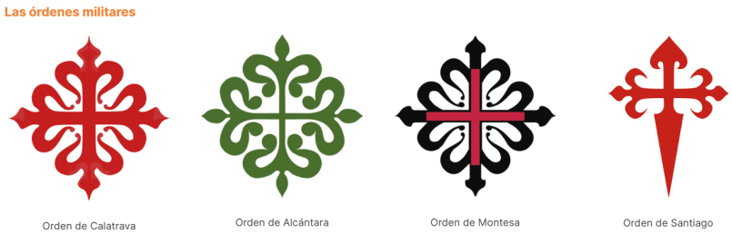

Por último, en Andalucía, Murcia, la costa valenciana y las islas Baleares, conquistadas por los cristianos más tarde, se empleó el **sistema del repartimiento**; es decir, el territorio se repartió de forma proporcional a la participación en la conquista. Así, los nobles recibieron grandes propiedades, y las gentes del común, pequeños lotes de tierra.

---

# 3. CULTURA Y SOCIEDAD DE LOS REINOS CRISTIANOS

## 3.1. El gobierno de los reinos cristianos.

El gobierno de los reinos cristianos peninsulares recayó en **reyes**. Estos tenían en teoría amplios poderes (mando del ejército, el cobro de impuestos o la concesión de títulos); sin embargo, este poder se veía disminuido por la importancia de los **señoríos** del clero y la nobleza. También las **ciudades**, con el tiempo, fueron un contrapoder.

Para gobernar los territorios el rey se apoyó del **Consejo Real**, que estaba formado por algunos miembros del clero (obispos, órdenes militares) y de la nobleza. A partir de finales del **siglo XII en León (primer ejemplo de parlamentarismo de Europa occidental)**, y en el siglo XIII en los demás reinos peninsulares, los reyes incorporaron a este Consejo a los burgueses ricos designados por las ciudades: nacían las **Cortes, asambleas formadas por representantes de los tres estamentos**. La función de las Cortes era discutir y votar las peticiones económicas que realizaba el rey (dinero para campañas militares o aprobación de un nuevo impuesto); a cambio; el rey se comprometía a tener en cuenta las peticiones de los diferentes estamentos.

Por último, **la autoridad del rey de Castilla siempre fue mayor que la de Aragón**. Castilla estaba formada por un sólo reino; mientras que Aragón no, ya que era una **unión de reinos** (Cataluña, Valencia, Baleares, Aragón), por eso el rey se veía obligado a tener la aprobación de las Cortes de cada uno de estos territorios (a excepción de Baleares, que no tenía Cortes). Es lo que se conoce como **pactismo**.

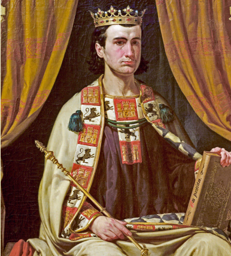

En conclusión, a diferencia de las Cortes actuales, estos primeros parlamentos no tenían capacidad de crear y aprobar leyes o de controlar la gestión del gobernante.

---

## 3.2. La sociedad de los reinos cristianos.

En los reinos cristianos peninsulares se impuso pronto la **sociedad estamental**, que dividió la sociedad entre una **minoría privilegiada**, el estamento eclesiástico y la nobleza, y la mayor parte de la población que los que eran privilegiados y los que constituía el **estamento no privilegiado**. Por último, encontramos a las **minorías no cristianas**.

**La nobleza y el clero constituían los estamentos privilegiados**. Como tales, disfrutaban de privilegios (no trabajar, no pagar impuestos, ser juzgados por sus propias leyes). No obstante, estos dos grupos no eran homogéneos, teniéndose que diferenciar entre alta y baja nobleza, así como alto y bajo clero. Las diferencias de riqueza marcaban estas diferencias internas.

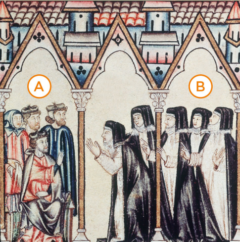

En los **no privilegiados**, los **campesinos** eran, sin duda, el sector mayoritario; trabajaban las tierras, por lo general, ajenas. Tenían, por ello, una gran dependencia de la nobleza y clero, propietarios de las tierras. En la Edad Media protagonizaron importantes **revueltas**.

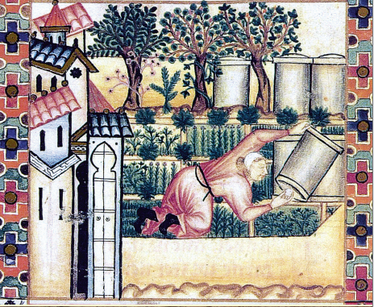

También entre el sector no privilegiado encontramos a los distintos **grupos sociales que poblaban las ciudades**: aquí encontramos un grupo que, al ser rico, vivía en condiciones similares a la nobleza, ya que eran **dueños de los gremios o grandes rebaños**. Luego, existía un grupo intermedio formado por **pequeños comerciantes** y, finalmente, los **asalariados**, que trabajaban en unas condiciones que rozaban la miseria.

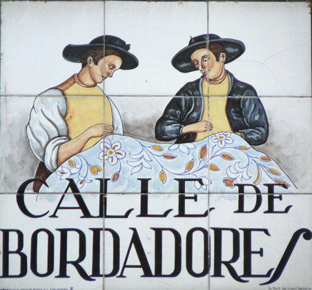

Por último, tenemos a los **marginados** de la sociedad **(mendigos, gentes sin oficio, etc.)**, que se asentaban, sobre todo, en las ciudades. Y no podemos olvidarnos de las minorías religiosas, en donde encontramos a la **población no cristiana**:

• **Judíos**: vivían en barrios urbanos propios, las juderías, y se dedicaban al préstamo, a la medicina, a ocupar importantes cargos funcionarios o a ser artesanos especializados; **serían expulsados de la Península en el 1492 por los Reyes Católicos**.

• **También encontramos a los musulmanes que vivían en territorio cristiano: los mudéjares**. Vivían en morerías y se dedicaban al trabajo de la tierra o a la artesanía, aunque es cierto que destacaron importantes especialistas en el estilo artístico mudéjar (arquitectos).

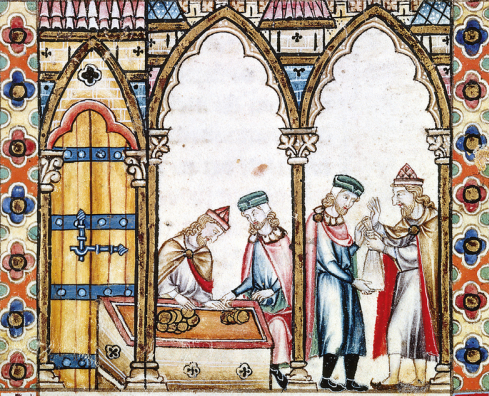

---
